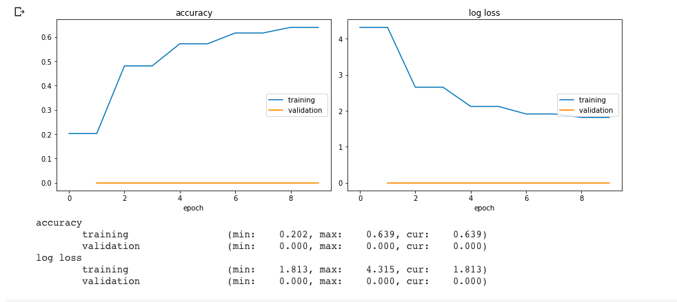

# Overview of training results

## GoogleNet

Training information:
* Model used: torchvision.models.googlenet (from Szegedy et al. 2014. Going Deeper with Convolutions. arXiv:1409.4842)
* Pretrained: Yes

Hyperparamters used:

* seed: 42
* learning rate: 1e-2
* momentum: 0.5
* batch size: 128
* test batch size: 1000
* number of epochs: 3

Transforms applied to training set:
* Resize to 224x224 (original images are 64x64)
* Random Horizontal Flips with probability 0.5
* Random Rotations of up to 10 degrees
* Normalized using standard deviation and mean
* Gaussian Noise added with mean of 0 and standard deviation of 0.004

Training GoogleNet with an 80-20 train-validation split: 

Training GoogleNet on the full set of training images with no stratified shuffle split:

## Data Augmentation

We tried different data augmentation techniques on VGG16, trained from scratch, on a subset of the training data. Based on this, we decided which techniques to use for the final models.

| Technique              | Improves Performance | Validation loss | Validation accuarcy | Validation F1 |
| ---------------------- | -------------------- | ------------------- | --------------- | ------------- |                   
| None                   |                      |      2.139          | 0.531           | 0.524         | 
| RandomHorizontalFlip() | &check;              |        2.000        | 0.580           | 0.577         | 
| RandomRotation(10)     | &check;              |         2.126       |    0.546        | 0.544         |
| ColorJitter(Brightness=(0.5,1.5), Contrast=(0.5,1.5), Saturation=(0.5,1.5), Hue=(-0.5,0.5)) | &cross; | 2.838 | 0.422 | 0.415 |
| ColorJitter(B=(0,11), C=(0,11), S=(0,11), H=(-0.5,0.5)) | &cross; | 2.168 | 0.396 | 0.384 |
| ColorJitter(B=(0,1), S=(0,1), C=(0,1), H=(0,0.5)) | &cross; | 3.737 | 0.345 | 0.345 |

## ResNet-34

## ResNet-50

## Wide ResNet-50

